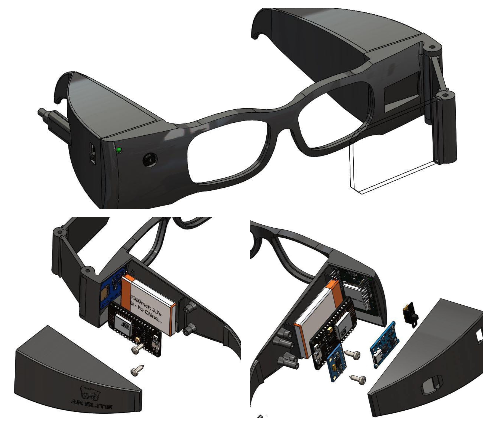

# SuperPower-Glass 

## Abstract
This project presents the design and implementation of glasses with integrated sensors for measuring temperature and detecting medical conditions, including epilepsy and other illnesses, with a specific focus on aiding autistic children. the glasses provide real-time health monitoring, enabling parents and caregivers to closely monitor the health status of the child. moreover, the glasses incorporate an educational component that teaches children between the ages of 4 and 8 about practical life skills such as animal and plant identification, letter and number recognition, and basic knowledge of quranic surahs. the poster highlights the importance of such technology in promoting the health and well-being of children while also facilitating their educational development. the use of scholarly language throughout the poster ensures a thorough and insightful analysis of the technology's potential to benefit children with various health conditions

## Block Diagram
The ESP32-CAM comes with integrated Wi-Fi and Bluetooth modules, which facilitate video streaming or image processing. Using image processing and Python, there is a library called OpenCV that is used to capture people's expressions and help the child recognize their emotions. The Adafruit (1.14 "240x135 Color TFT Breakout LCD screen) displays a compact display unit that provides high-resolution colorful display. The screen is positioned at a 45-degree angle with a mirror for reflection and comes with a PMMA plano-convex lens, an acrylic lens with a diameter of 30 mm and a focal length of 100 mm, which is a common type of lens used in optical systems.

The video is received through Firebase and web and mobile data, and the tutorial program is selected for use with the user. The MLX90614 infrared (temperature sensor) and MPU6050 (fall detection sensor) data is captured and sent to Firebase, and then displayed on the web and mobile devices. The data is received and sent to Firebase via ESP8266, a precise Wi-Fi network processor. While designing the glasses using 3D printing, a lithium battery was included and a charger and converter were used to achieve optimal performance.

